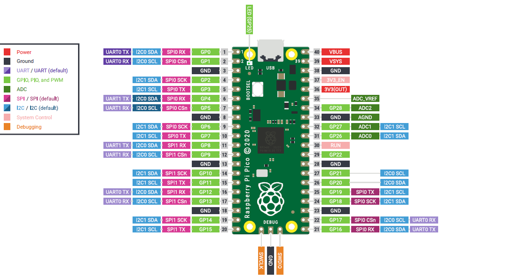

## Introduction 
This project seeks to teach step by step some concepts on embedding and realtime from bare metal to an RTOS

## Getting Started
Each chapter will contain instructions to build and run but in general terms you require to have cmake installed.

## Build and Test
See each sub folder

## Contribute
Share and contribute with Pull requests

## RP2040 - Pin Out

## Example 1 - led blink 

https://github.com/sequeirandres/embeddedAndRT/assets/72326236/2cb190ed-d5c3-42f3-a765-9e20b606a7c3

## Example 2 - FreeRTOS - blink 

https://github.com/sequeirandres/embeddedAndRT/assets/72326236/87c48b9c-f57a-4607-b1f0-3886226fd7d1

## Example 3 - FreeRTOS - VsemaphoreCreateBinary 

https://github.com/sequeirandres/embeddedAndRT/assets/72326236/2968966c-73c3-4f42-ab02-ae6689a1342b

## Example 4- FreeRTOS - VsemaphoreMutex 

https://github.com/sequeirandres/embeddedAndRT/assets/72326236/8c550f9a-a94d-4def-8f44-966df8f7735d

[Mutex Code (main.c)](https://github.com/sequeirandres/embeddedAndRT/blob/main/RP2040-freeRTOS-Mutex/src/main.c)

